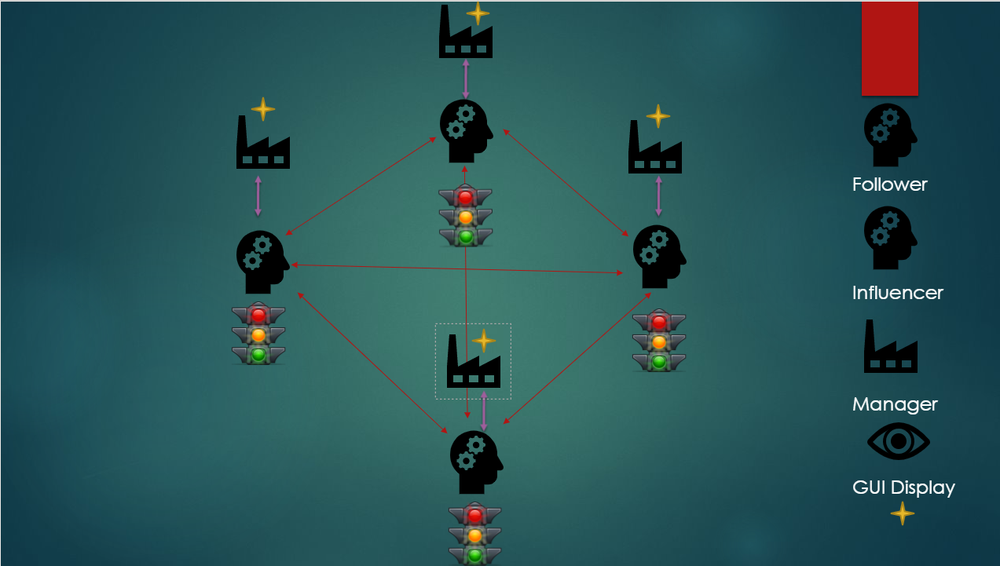

Regularflow
========================================================

(The project is under construction, the document and code documentation will evolve you can ask me if you don't understand).

This module allows you to create trafic light clusters that interact together to regulate circulation.
Trafic lights are smart and can take decision according to the environnement.

I use Deep-renforcement Q learning for the first POC and Actor-Critic A3C for the next POC

# Introduction

There are two types of traffic lights. Influencers and Followers. 
Influencers are traffic lights that train and followers are trafic lights symmetrical to their influencers. A follower will take the opposite action of an influencer. 
This allows the case managed two traffic lights that don't have to be green at the same time
    
When we create an influencer we can assign him a follower and this follower will take the opposite actions of this influencer.
To create a cluster of traffic lights that communicate with each other for the regularisation of a zone it's simple. When we create a fire we give the id of the other traffic lights

Managers are fake cameras to simulate the number of cars and pedestrians on the way of a traffic light. Each traffic lights has a manager who tells him the numbers of cars and pedestrians on his way.

Depending on the numbers of cars and pedestrians the traffic lights are rewarded. Each traffic light knows the status of all the others traffic lights which are into the cluster. 
If a traffic light is overbooked and causes the bottling of another traffic light, traffic lights will adapt to gain the most reward and therefore regulate the traffic

You need to have Apache Kafka and Zookeper for the stream communication.



# First you need to create topic's partitions : 
## One for Manager's communications and one for traffic lights communications

* Download apache kafka here https://kafka.apache.org/downloads
* Install regularflow with setup :

    ```./setup install```

* Start a kafka's broker and a Zookeper's server
* Run this code in an python's interpreter

```python
from confluent_kafka.admin import AdminClient, NewTopic

adminConfig = {
                'bootstrap.servers': 'localhost:9092'
              }

topicList = ["manager0", "cluster0", "display"]    # Topic Names
partitions = [4, 4, 4]   # Here replace the number 4 by the number of Trafic light that you want in the cluster
replications = [1, 1, 1]

if __name__ == '__main__' :
    newTopics = []
    adminClient = AdminClient(adminConfig)
    adminClient.delete_topics(topicList)
    adminClient.delete_topics(["__consumer_offsets"])
    for i in range(len(topicList)):
        newTopics.append(NewTopic(topicList[i], partitions[i] , replications[i]))
    print(newTopics)
    adminClient.create_topics(newTopics)

```

# Here it's an example of configuration trafic's light of type "follower"

```python
from regularflow import newAgent, startDemo, startAgent

consumerConfig = {
                'bootstrap.servers': 'localhost:9092',
                'group.id': 'cluster0',
                'auto.offset.reset': 'earliest'
                }
producerConfig = {
                'bootstrap.servers': 'localhost:9092'
                 }

agent = newAgent(1, consumerConfig, producerConfig, "cluster0", "manager0","display", "follower")  # the first number is the id of the traffic light
agent._setAgents([0]) # Here type the id of the other trafic light in the cluster for the communication
startDemo(agent) # run the agent with startDemo for the non-training mode and with startAgent for the training mode
```
# Here it's an example of configuration trafic's light of type "influencer"

```python
from regularflow import newAgent, startDemo, startAgent

consumerConfig = {
                'bootstrap.servers': 'localhost:9092',
                'group.id': 'cluster',
                'auto.offset.reset': 'earliest'
                }
producerConfig = {
                'bootstrap.servers': 'localhost:9092'
                 }


agent = newAgent(0, consumerConfig, producerConfig,"cluster0", "manager0", "display", "influencer") # the first number is the id of the traffic light
agent._setAgents([1]) # set the id of other traffic lights in the cluster for communication
agent._setForbidenAgents([1]) # set the follower's id of this influencer
agent._restore("/home/roloman/projet-perso/regularflow/example/saves/save_influencer0") # setup the path of the the saved model
startDemo(agent)  # start agent with startDemo for start with non-training mode
agent._save() # specify the save for save this traffic light
```


# Usage example :

## for an example go in the example directory and run in differents terminals : 
* The code for initialisation topic's partitions
* Influencer.py and Follower.py
* Then Manager0.py and Manager1.py

You can see the training mode

## Author
- [Slohan.S](https://github.com/L-Antique)
